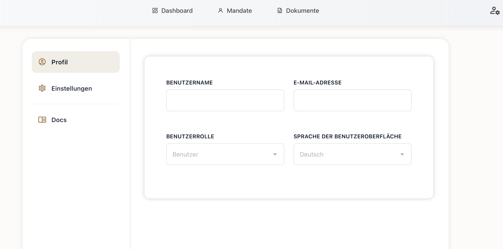
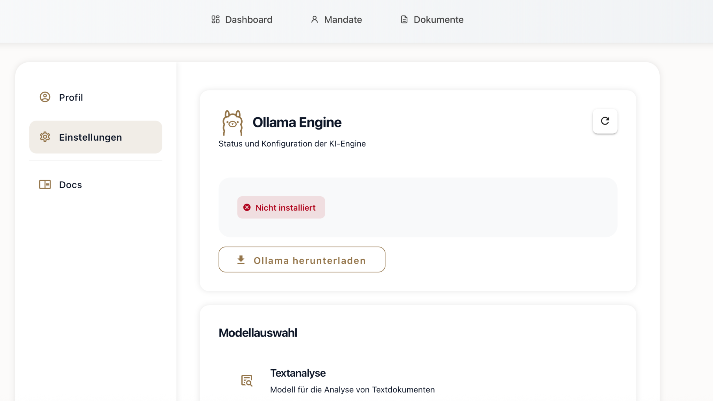

Im Bereich **Einstellungen** können Nutzer ihre persönlichen Informationen sowie Systemkonfigurationen verwalten.

###  Profil

Unter dem Reiter **Profil** lassen sich folgende Angaben bearbeiten:

- **Benutzername**: Individuell wählbarer Name zur Anzeige.
- **E-Mail-Adresse**: Kontaktadresse für Benachrichtigungen.
- **Benutzerrolle**: Auswahl zwischen verschiedenen Rollen (z. B. Benutzer, Admin).
- **Sprache der Benutzeroberfläche**: Derzeit verfügbar: *Deutsch*.

---

###  KI-Engine: Ollama

Im Unterpunkt **Einstellungen** kann die Integration der **KI-Engine Ollama** konfiguriert werden.

- **Statusanzeige**: Zeigt an, ob Ollama installiert ist. In unserem Beispiel: *Nicht installiert* (rotes Warnsymbol).
- **Button „Ollama herunterladen“**: Über diesen Button wird automatisch das aktuelle Modell geladen und installiert – ein externer Link zur offiziellen Seite ist dafür nicht erforderlich.

#### 🔍 Modell-Auswahl

Im unteren Abschnitt können vorbereitete Modelle wie z. B. **„Textanalyse“** ausgewählt werden. Dieses Modell ist für die semantische Analyse von Textdokumenten vorgesehen.

---

###  Hinweis zur KI-Verarbeitung (Projektkontext)

Die Integration der Ollama-KI wurde im Rahmen unseres Projekts an der **Technischen Hochschule Augsburg** testweise evaluiert.  
Eine vollständige technische Implementierung ist zum jetzigen Zeitpunkt **nicht Bestandteil der finalen Software**, sondern wurde lediglich im Rahmen eines Prototyps bzw. Proof-of-Concept getestet.  
Ziel war es, die Machbarkeit einer lokalen KI-Engine in Kombination mit der Dokumentenanalyse zu prüfen. Eine zukünftige Integration ist jedoch vorgesehen.

Die Anbindung an das **Frontend ist derzeit noch nicht umgesetzt**. Dennoch war es bereits möglich, mithilfe der KI potenzielle **Platzhalter in Textdokumenten automatisiert zu erkennen**.  
So könnten beispielsweise bestehende Verträge eingelesen und automatisiert in editierbare Vorlagen umgewandelt werden – ein wesentlicher Schritt hin zur intelligenten Dokumentenverarbeitung.
