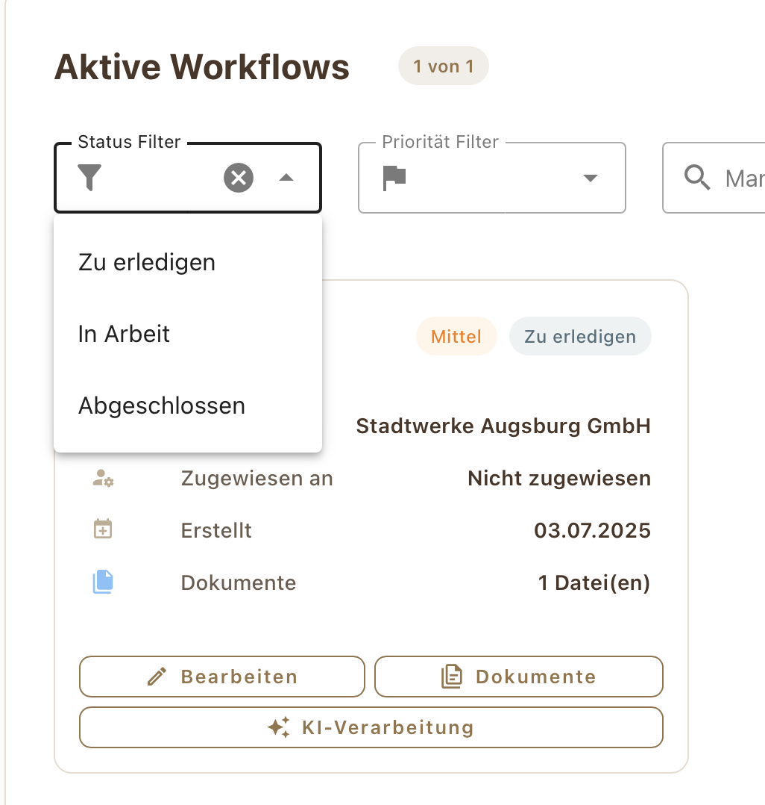
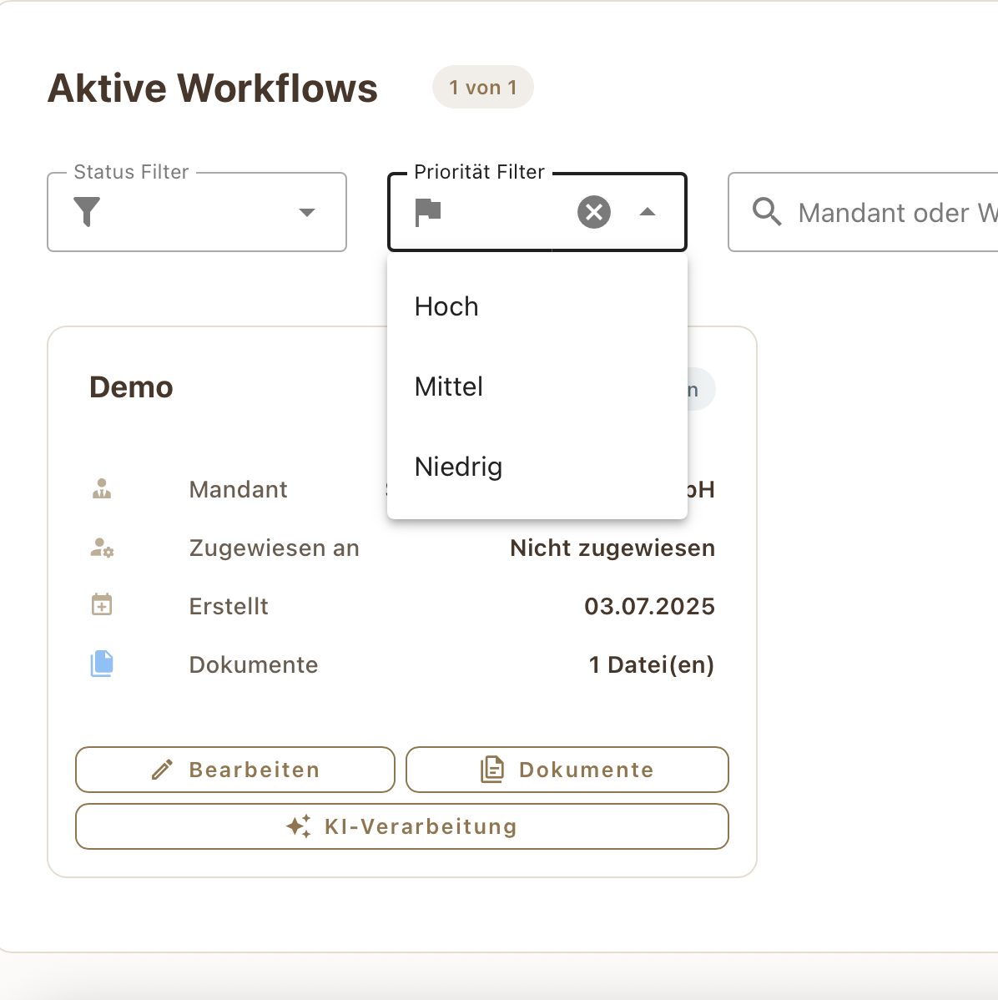
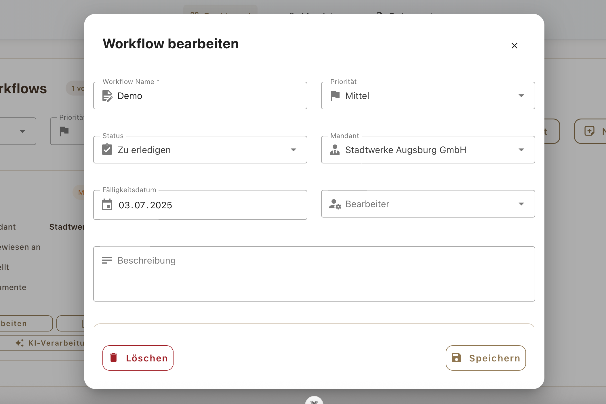
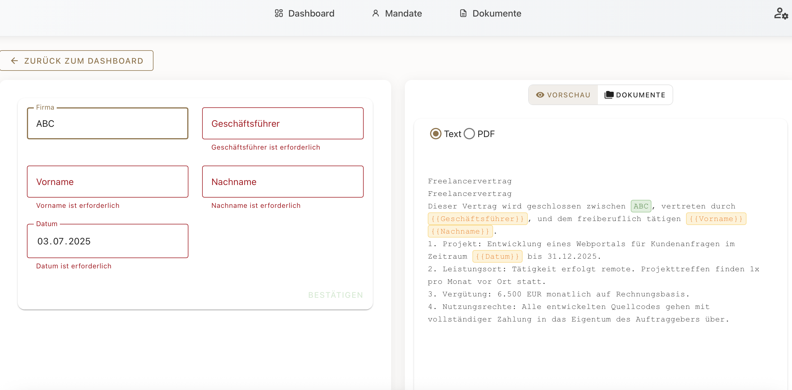
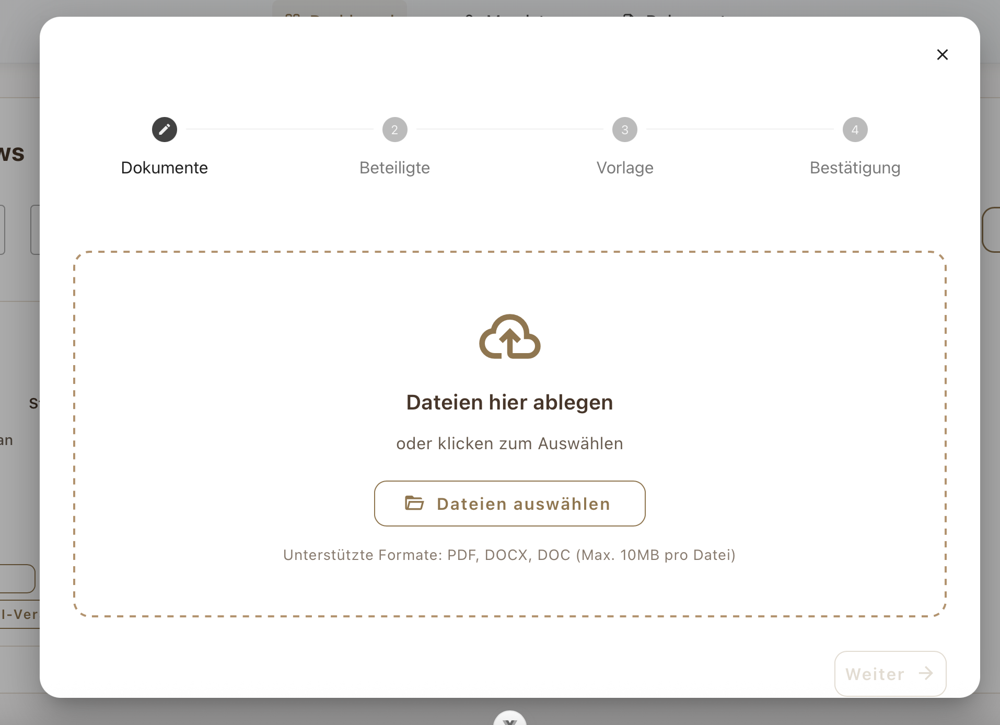
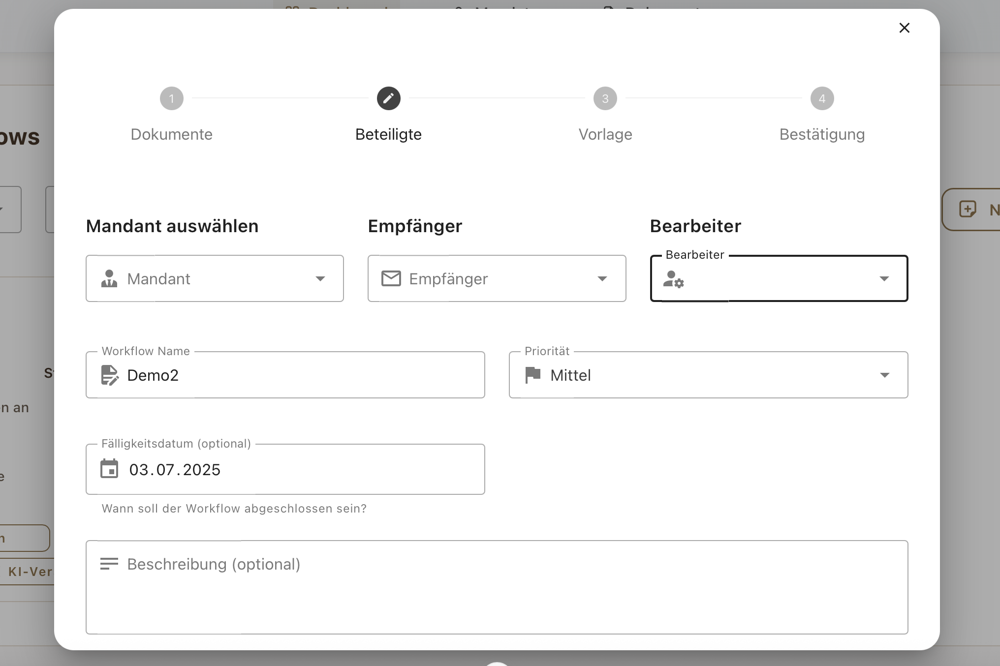
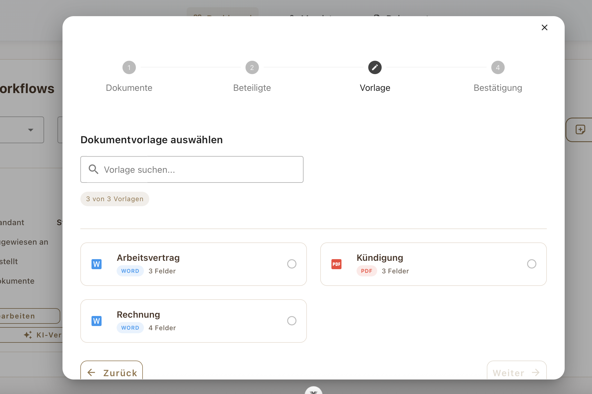
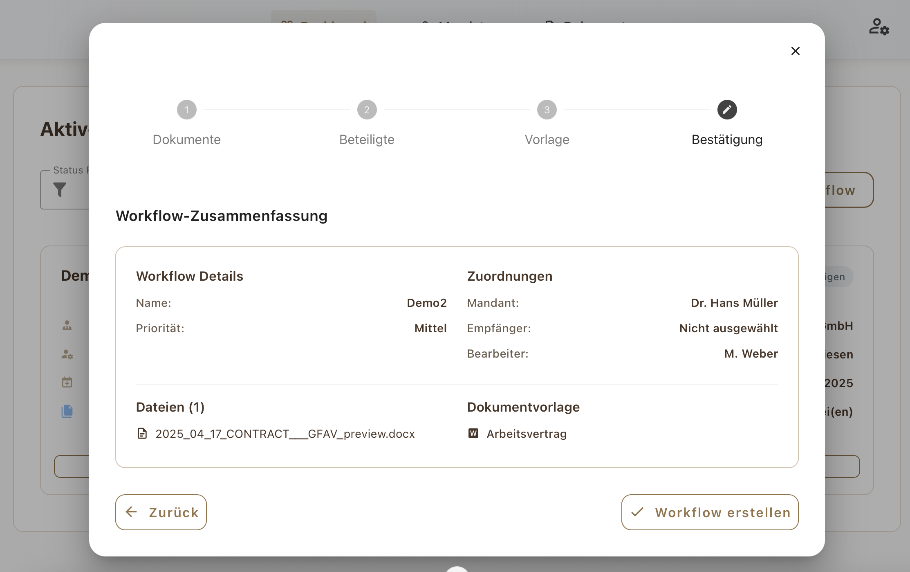

#  Dashboard – Aktive Workflows

Im Dashboard erhältst du eine Übersicht aller aktuell laufenden Workflows. Jeder Workflow stellt einen konkreten Fall dar – z. B. eine Steuererklärung, ein Audit oder ein Vertrag.

---

##  Übersicht der Workflows

Die folgende Abbildung zeigt die Hauptansicht des Dashboards:

> In der Dashboard-Ansicht werden alle aktiven Workflows als Karten dargestellt. Über die obere Leiste kannst du nach **Status**, **Priorität** oder nach einem **Mandanten- bzw. Workflownamen** filtern.

---

##  Filterfunktionen im Detail

### Statusfilter

Mit dem Statusfilter kannst du Workflows nach ihrem Bearbeitungsstatus ein- oder ausblenden:

- **Zu erledigen**
- **In Arbeit**
- **Abgeschlossen**

> Sobald du einen Status auswählst, werden nur noch Workflows mit diesem Status angezeigt. 

---

### Prioritätsfilter

Der Prioritätsfilter ermöglicht die Sortierung nach Dringlichkeit:

- **Hoch**
- **Mittel**
- **Niedrig**

> Auch dieser Filter kann bei umfangreichen Projekten helfen, gezielt die wichtigsten Aufgaben im Blick zu behalten.

---

##  Workflow-Karten & Bearbeitungsfunktionen

In der Dashboard-Übersicht werden alle aktiven Workflows als **Karten** dargestellt. Diese enthalten auf einen Blick zentrale Informationen zum jeweiligen Vorgang.

###  Informationen pro Workflow:

- **Workflow-Name**: z. B. „Demo“, „Jahresabschluss 2025“
- **Priorität**: Hoch, Mittel oder Niedrig (farblich gekennzeichnet)
- **Status**: z. B. „Zu erledigen“ oder „In Arbeit“ oder „Abgeschlossen“
- **Mandant**: Verknüpfte Person oder Organisation
- **Zugewiesen an**: Wer für diesen Vorgang zuständig ist
- **Erstellt**: Datum der Erstellung
- **Dokumente**: Anzahl verknüpfter Dateien

Unterhalb der Karte befinden sich drei wichtige Aktionsbuttons:

-  **Bearbeiten** – öffnet das Bearbeitungsformular für den Workflow  
-  **Dokumente** – zeigt die zugehörigen Dateien  
-  **KI-Verarbeitung** – startet die automatische Analyse eines Dokuments und erkennt die Platzhalter. Diese Funktion ist aktuell noch nicht vorhanden. Für weitere Informationen wird auf die "Hinweis zur KI-Verarbeitung (Projektkontext)" in der Doku bei Einstellungen. 

---

##  Workflow bearbeiten

Beim Klick auf den Button „Bearbeiten“ öffnet sich ein modaler Dialog zur Änderung aller relevanten Workflow-Daten.

Hier kannst du:

- Den Namen, Status und die Priorität des Workflows ändern
- Einen Mandanten oder Bearbeiter zuweisen
- Ein Fälligkeitsdatum setzen
- Eine Beschreibung hinzufügen
- Den Workflow endgültig löschen (unten links)

> Änderungen werden erst durch Klick auf „Speichern“ übernommen. Mit dem ❌-Symbol kannst du den Filter wieder entfernen.

---

##  Platzhalterformular & Dokumentenvorschau

Wenn du auf eine Workflow-Karte klickst oder über „Dokumente“ gehst, öffnet sich das zugehörige **Dokumentenformular**. Hier erkennt die KI automatisch alle Platzhalter (z. B. `{{Firma}}`, `{{Datum}}`, `{{Nachname}}`) aus der Vorlage.

### Funktionen im Überblick:

-  **Linke Seite**: Eingabemaske für alle dynamischen Platzhalter
-  **Rechte Seite**: Live-Vorschau des ausgefüllten Dokuments (Text oder PDF-Modus)
-  **Dokumente-Tab**: Auswahl zwischen mehreren Vorlagen oder Dateien
-  **Bestätigen**: Sobald alle Felder ausgefüllt sind, kann das Dokument exportiert werden

> Die automatische Platzhaltererkennung funktioniert für Word- und PDF-Dokumente mit standardisierter Platzhalter-Syntax (z. B. `{{Name}}`).

---

##  Neuen Workflow erstellen

## 1.  Dokumente hochladen

- Starte den Prozess über **„Neuer Workflow“**
- Ziehe Dateien per **Drag & Drop** in das Upload-Feld oder klicke auf **„Dateien auswählen“**
- **Unterstützte Formate**:
  - PDF, DOCX, DOC
  - Max. 10 MB pro Datei
- Diese Datei bildet die Basis des Workflows (z. B. Vertragsentwurf, Rechnung)

---

## 2.  Beteiligte definieren

Trage alle Beteiligten und Basisdaten ein:

- **Mandant** auswählen
- **Empfänger** festlegen (z. B. derjenige, der das fertige Dokument erhält)
- **Bearbeiter** bestimmen (interne Zuständigkeit)

Weitere Angaben:

- **Workflow-Name** (z. B. „Demo2“)
- **Priorität** (z. B. Mittel, Hoch, Niedrig)
- **Fälligkeitsdatum** (optional)
- **Beschreibung** (optional, z. B. Hintergrund oder Hinweise)

---

## 3.  Dokumentenvorlage auswählen

- Wähle eine passende **Vorlage** für dein Dokument:
  - Arbeitsvertrag *(Word, 3 Platzhalter)*
  - Rechnung *(Word, 4 Platzhalter)*
  - Kündigung *(PDF, 3 Platzhalter)*
- Die Vorlagen enthalten dynamische Felder, die im späteren Schritt automatisch befüllt werden.

---

## 4.  Zusammenfassung & Bestätigung

- Übersicht aller Angaben:
  - **Workflow-Name & Priorität**
  - **Zugeordnete Personen** (Mandant, Empfänger, Bearbeiter)
  - **Hochgeladene Datei**
  - **Ausgewählte Vorlage**
- Klicke auf **„Workflow erstellen“**, um den Prozess abzuschließen.

---

>  Hinweis: Nach Erstellung kannst du im Dashboard den Status verfolgen, Platzhalter befüllen, PDF exportieren oder weitere Dokumente hinzufügen.