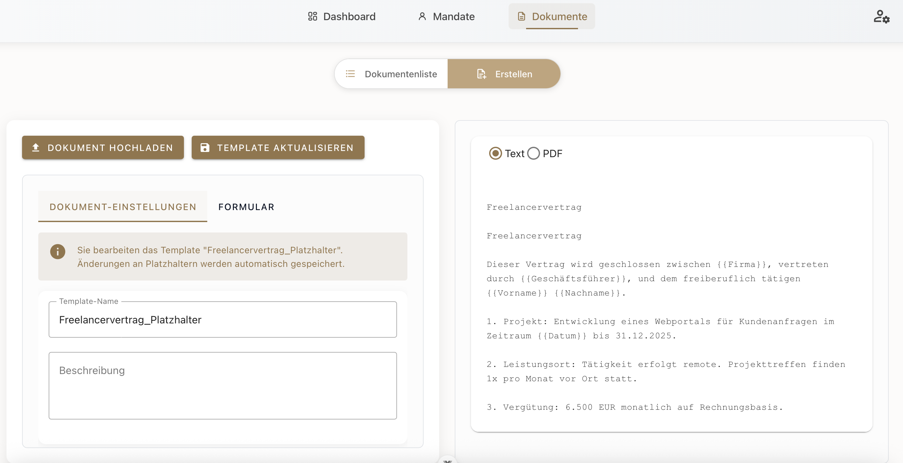
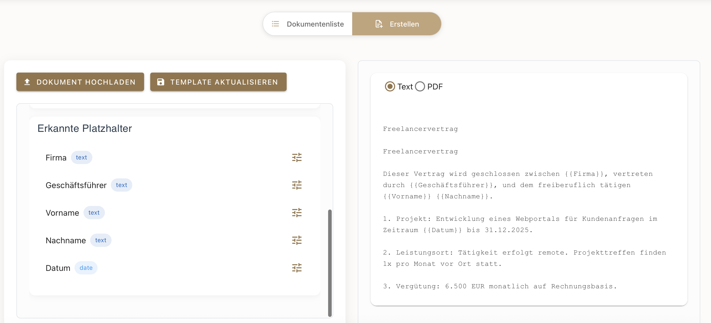
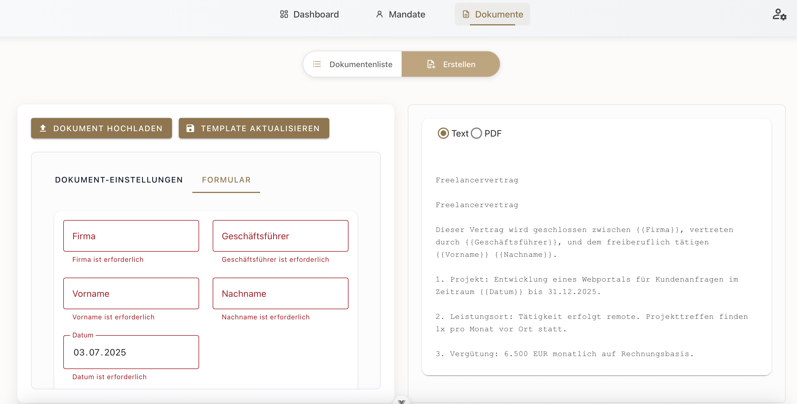
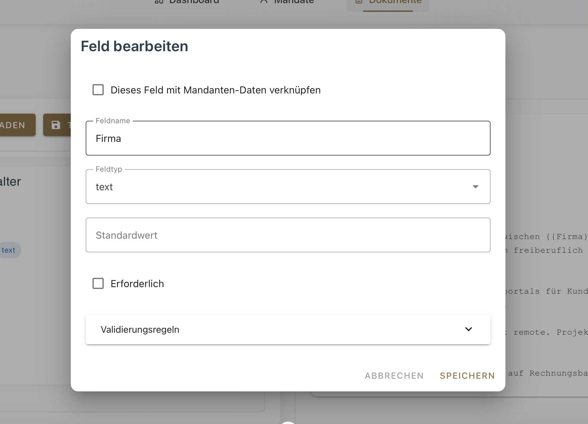
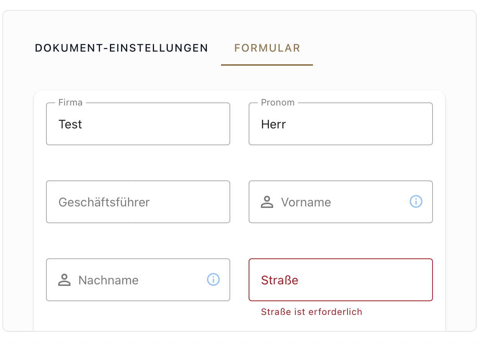
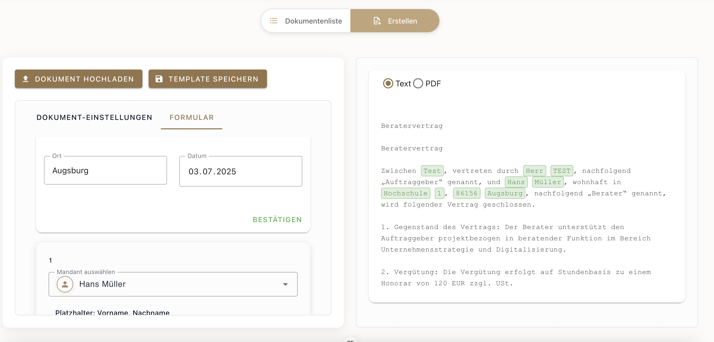

#  Dokumenten-Seite – Vorlagen erstellen & verwalten

##  Übersicht

Die **Dokumenten-Seite** dient der zentralen Verwaltung und Bearbeitung aller **Mustervorlagen** (Templates).  
Hier kannst du neue Vorlagen hochladen, bestehende bearbeiten, Platzhalter definieren und diese später im Workflow verwenden.

---

##  Dokumentenliste

In der **Dokumentenliste** findest du alle bereits erstellten oder hochgeladenen Templates.  
Angezeigt werden:

- **Name** der Vorlage
- **Typ** (z. B. Word, PDF)
- **Erstellungsdatum**
- **Anzahl erkannter Platzhalter**

Funktionen:
- **Ansehen** → öffnet die Bearbeitungsmaske für das Template
- **Löschen** → entfernt die Vorlage endgültig

---

##  Dokumentenvorlage bearbeiten

In der Bearbeitungsansicht stehen dir zwei Tabs zur Verfügung:

**Dokument-Einstellungen**  
– Template-Name  
– Beschreibung  

**Formular**  
– Vorschau auf die Textinhalte mit dynamischen Platzhaltern  
– Liste der automatisch erkannten Platzhalter (z. B. `Firma`, `Datum`, `Vorname`, `Nachname`)

---

##  Platzhalter bearbeiten

Jeder Platzhalter im Dokument kann individuell angepasst werden:

- **Feldname** und **Typ** (Text, Datum usw.)
- Option „Erforderlich“ aktivieren
- **Standardwert** hinterlegen
- **Validierungsregeln** festlegen

Optional kannst du ein Feld **mit einem Mandanten-Datenfeld verknüpfen** (siehe nächster Abschnitt)

##  Platzhalter mit Mandantendaten verknüpfen

Die Plattform bietet die Möglichkeit, Platzhalter-Felder in Vorlagen direkt mit Daten aus der Mandantendatenbank zu **verknüpfen**.  
So lassen sich z. B. Name, Adresse oder Steuernummer automatisch aus dem jeweiligen Mandat übernehmen – ideal zur Automatisierung wiederkehrender Dokumente.

###  So funktioniert’s:

1. Öffne ein vorhandenes Dokument in der Bearbeitung
2. Wechsle in den Tab **„Formular“**
3. Klicke bei einem Platzhalter (z. B. `{{Firma}}` oder `{{Nachname}}`) auf das **Bearbeiten-Symbol**
4. Aktiviere die Checkbox **„Dieses Feld mit Mandanten-Daten verknüpfen“**

5. Wähle:
   - Die **Mandanten-Gruppe** (z. B. 1 bei Einzelverknüpfung)
   - Das **Mandanten-Feld**, z. B. `Vorname`, `Nachname`, `Adresse`, `USt-ID`, etc.

 Sobald ein Feld mit einem Mandanten-Feld verknüpft ist:
- Wird der Wert **automatisch befüllt**, sobald du im Formular später einen Mandanten auswählst
- Sind **Standardwerte und Validierungsregeln deaktiviert**, da die Daten fest aus dem Mandantenprofil übernommen werden

---

##  Neue Vorlage hochladen

Über den Button **„Dokument hochladen“** kannst du eine neue Word- oder PDF-Vorlage in das System laden.  
Der Platzhalter-Parser erkennt automatisch Felder wie `{{Vorname}}`, `{{Datum}}` etc.

---

##  Formular ausfüllen & Vorschau generieren

Im **Formular-Modus** kannst du:

1. Alle Felder manuell ausfüllen **oder**
2. Einen **Mandanten auswählen**, um Daten automatisch zu übernehmen

 Nach dem Ausfüllen kannst du:

- Eine **Live-Vorschau** generieren (Text oder PDF)
- Das fertige Dokument **exportieren oder teilen**

---