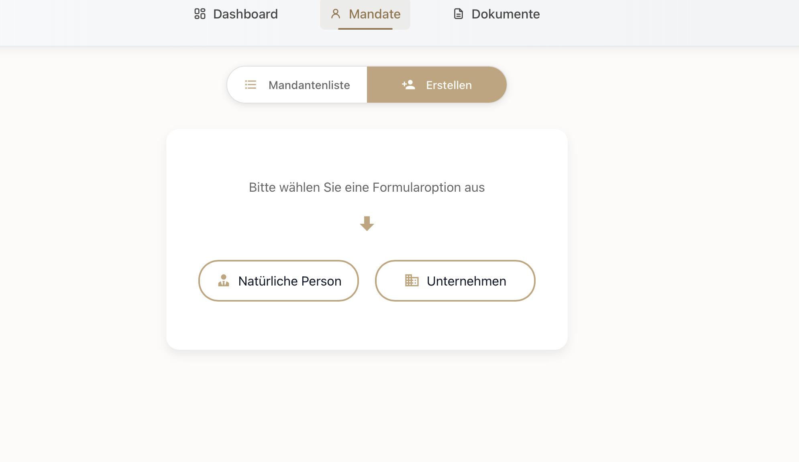
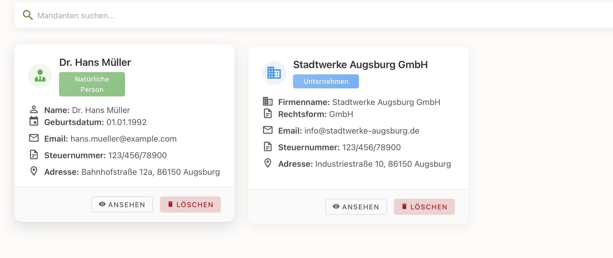

#  Mandanten-Erstellung & -Verwaltung

##  Überblick zur Mandanten-Seite

Die **Mandanten-Seite** dient zur zentralen Verwaltung aller Kunden- bzw. Mandatsdaten.  
Hier können neue **Mandate erfasst**, bestehende **bearbeitet**, **eingesehen** oder bei Bedarf **gelöscht** werden.

Man unterscheidet zwischen zwei Arten von Mandaten:
- **Natürliche Person** – z. B. Privatpersonen, Freiberufler
- **Unternehmen** – z. B. GmbHs, AGs, Einzelunternehmen

Die gepflegten Daten werden im gesamten System verwendet, insbesondere bei der **Workflow-Erstellung** oder in Dokumentenvorlagen.

---

##  Mandanten anlegen

- Durch Klick auf **„Erstellen“** öffnet sich die Auswahlmaske:
  - **Natürliche Person**
  - **Unternehmen**

Je nach Auswahl öffnet sich das entsprechende Formular zur Erfassung:

Für **natürliche Personen**:
- Persönliche Daten (Name, Geburtsdatum, Adresse, E-Mail)
- Steuerinformationen (Steuernummer, Steuer-ID, USt-ID, Finanzgericht)
- Zuständiges Finanzamt (inkl. Adresse, Telefonnummer, Fax, Mail)
- Ansprechpartner (optional)
- etc...

Für **Unternehmen**:
- Firmenname, Rechtsform
- Kontaktdaten & steuerliche Angaben
- Finanzamt und Ansprechpartner wie bei natürlichen Personen
- etc...

 Nach Eingabe aller Daten klickst du auf **„Speichern“** bzw. **„Bestätigen“**, und der Mandant wird im System angelegt.

---

##  Mandantenliste & Detailansicht

Alle angelegten Mandanten erscheinen in der **Mandantenliste**. Diese ist übersichtlich in Kartenform aufgebaut und bietet:

- **Suchfunktion** oben über das Eingabefeld
- Visuelle Unterscheidung zwischen „Natürliche Person“ und „Unternehmen“
- Direkte Anzeige zentraler Informationen:
  - Name, E-Mail, Steuernummer, Adresse, Geburtsdatum (bei natürlichen Personen) bzw. Firmenname & Rechtsform (bei Unternehmen)

Jede Karte bietet zwei Aktionen:
- **„Ansehen“**: Öffnet die Detailansicht zur Bearbeitung aller Daten
- **„Löschen“**: Entfernt den Mandanten dauerhaft

In der **Detailansicht** können sämtliche Felder nachträglich angepasst werden – ideal z. B. bei Änderungen der Anschrift, Ansprechpartner oder Steuerdaten.

---

>  **Tipp**: Ein gepflegter Mandantenstamm ermöglicht schnelles Ausfüllen von Dokumenten-Vorlagen und spart doppelte Eingaben.
